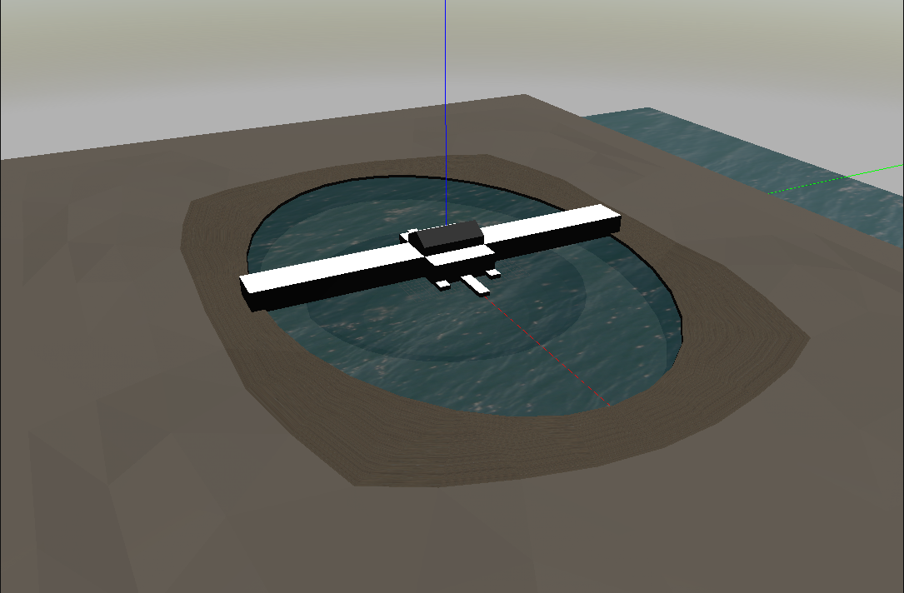
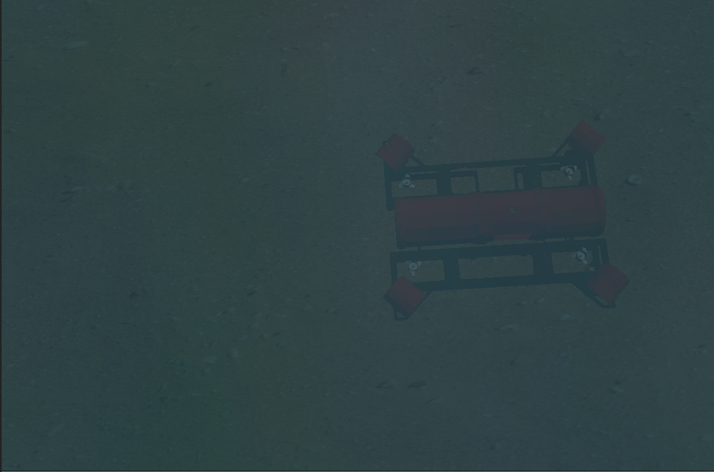
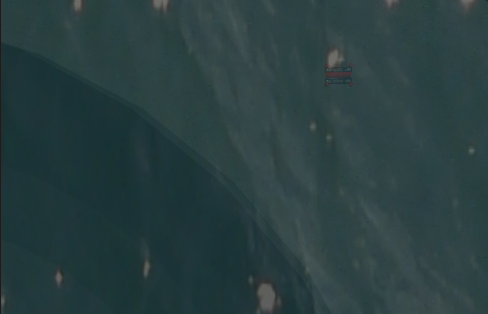

# Riptide Gazebo



The team's simulator runs on Ubuntu 16.04 with ROS Kinetic but newest updates can only run on 18.04 with ROS Melodic. For latest developments (most of this readme refers to), checkout branch "/tweaker". This package is still a work in progress.





## Setup

```text
cd ~/osu-uwrt/riptide_setup/scripts/setup_scripts
```
```text
./install_simulator.sh
```
```text
./update_system.sh
```

## Understanding the files within riptide_gazebo package
Note: Keep in mind there are other important files to the simulator that are not in riptide_gazebo but instead riptide_description (robot's xacro files and models) or riptide_bringup (simulation.launch).

### launch
world.launch - this just launches an empty transdec world. Important launch arg: world. For example "roslaunch riptide_gazebo world.launch world:=run9"

### models
these are all the models used in world files. We use colladae files because texture info is also stored. In the models folder, every model has its own folder with the .dae file, a model.config file, and a model.sdf file. In doing this, we can reference models throughout world files.

### scripts
automation_handler.py - this is the launch-kill script that will run through every generated world. Right now it does only that but soon it will deem success/failure percentages depending on what task code is being tested.

### worlds
2019_finals.world - this is transdec with default environment parameters. It is what world.launch defaults if no world args are specified.

generateRuns.py - right now you must edit the parameters at the top of the file because the GUI does not yet exist. Parameters like prop location mean, prop location standard deviation, number of runs, etc.
 
generateWorlds.py - it reads the run_config xml file and generates the world sdf files accordingly

props_template.xml - all the sdf snippets of models used by generateWorlds.py 

run_config.xml - this is for manual specification of worlds. 

run_config2.xml - this is what generateRuns.py generates worlds onto

run_template.xml - sdf skeleton used by generateWorlds.py

## Testing Task Code with Tweaker

If you wish to generate random worlds with random environment variations, switch over to git branch "/tweaker". You must switch riptide_descriptions and riptide_bringup to this branch as well. The OS must be 18.04 with ROS Melodic. 

### Understanding the Environment Parameters
These descriptions help give users a background for how to specify parameters. Please also refer to http://sdformat.org/spec?ver=1.6&elem=scene

#### Ambience
Ambience refers to "color of ambient light" and can be thought of as the world's color tint. It is defined by 4 floats. For example, the default ambience is 0.4 0.4 0.4 1

#### Props
Implemented props might include the gate, Cutie, or the crucifix. Their sdf snippets are held within the props_template.xml file. They have a 6 float location and orientation to be specified. x, y, z, roll, pitch, and yaw.

#### Fog
Fog has a color and a "thickness" that works by defining the start and end of a gradient. 

#### Lights (Sun)
Direction, location, brightness

## Using generateWorlds.py

Specify in the run_config.xml file what you want each run's environment paramters to be. generateWorlds.py reads this config file so be sure to specify the correct one.

## Using generateRuns.py then generateWorlds.py

First, delete all past generated run#.world files that might be inside of the riptide_gazebo/worlds folder. In generateRuns.py, specify the means and standard deviations of the environment parameters as well as number of runs. Run the script using "python generateRuns.py" and it will the generate appropriate number of random worlds and write to run_config2.xml. Make sure generateWorlds.py is reading run_config2.xml and not run_config.xml, then run generateWorlds.py. You should see all of the run#.world files pop up inside the world folder. Specifying num_runs to be 10 would create run0.world to run9.world.

## Using automation_handler.py

Make sure that num_runs matches with the amount of worlds you generated or how ever many you wish to test through. Then run "python automation_handler.py" and this should launch and kill every run#.world with the robot also spawning inside. Right now, nothing happens during the world's lifetime; it just waits for 60 seconds before killing and 10 more seconds before launching the next run#.world.

## FAQ and Troubleshooting

on 2 seperate machines running 18.04 gazebo i got:

[Err] [REST.cc:205] Error in REST request
libcurl: (51) SSL: no alternative certificate subject name matches target host name 'api.ignitionfuel.org'

on both occasions this was resolved by a) installing gazebo9 and b) running "sudo apt upgrade libignition-math2"
